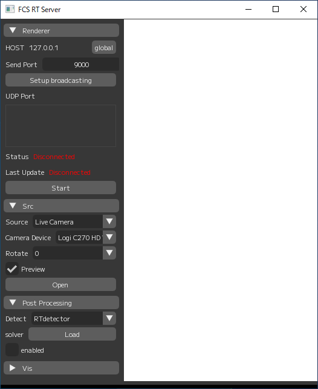

## Unityとのリアルタイム通信
FCSは、Unityにリアルタイムでデータ送信する機能を持っています。  
この機能を使うためには、FCS側とUnity側でそれぞれ操作が必要です。  

### Unity側の設定
1. FCS_RealtimeFaceAnim.cs, FCSReceiveController.csをUnityにインポートします。 
  
2. インポートしたスクリプトを動作させたいGameObjectにアタッチします。 
  
3. アタッチしたFCS_RealtimeFaceAnimのインスペクターでFaceを設定します。 
   選択するObjectは、顔のObject(BlendShapesが設定されているObject)であればOKです。 
  
4. アタッチしたFCSReceiveControllerのインスペクターでIPAddressとPortを設定します。 
   IPAddressとPortは、FCSRT側の設定と同じIPAddressとPortを指定します。 
5. FCSRT側のSetup終了後、ゲーム再生を実行します。 

### FCSRT側の設定
1. FCSRTを起動します。 
  
2. SendPortを指定します。このポート番号はUnity側で設定したポート番号と同じにする必要があります。 
　 Unity側のポート設定を確認後、Setupbroadcastingをクリックします。 
3. Unity側との通信が確立された場合、Status,LastUpdateがConnectedに変わります。 
  
4. Camera Deviceから使用するカメラを選択し、Openをクリックします。 
5. RendererタブのStartをクリックし、コントローラ値の送信を開始します。 

