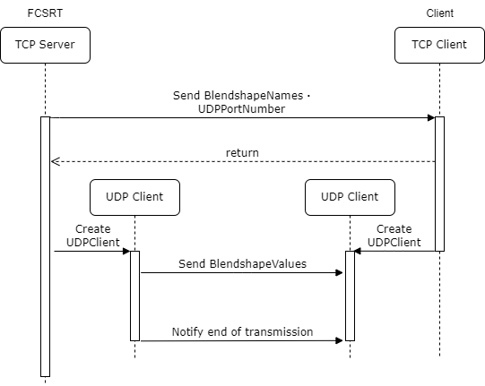

## FCSRT
FCSRTは、リアルタイム通信用のソフトウェアです。 
UnityやUnrealEngineなどゲームエンジンと接続すると、コントローラの値をリアルタイムで送信することができます。 

### UI説明   
  
左がコントロールパネル、右がカメラ・動画表示エリアです。 
- Rendererタブ 
    - Host: 接続先のIPアドレス 
    - SendPort: TCP接続用のポート番号 
    - UDPPort: UDP接続用のポート番号 
    - Status: 接続状態を表示します。 
    - LastUpdate: 最後に送信されたデータの時間を表示します。  
- Srcタブ 
    - Source: ソースの種類を選択(LiveCamera, VideoFile) 
        - LiveCamera 
            Camera Device: カメラデバイスを選択 
        - VideoFile 
            File Name: 動画ファイルのフルパス 
    - Rotate: 表示するカメラ画面の回転 
    - Preview: プレビュー表示 
    - Open: カメラ・動画映像を表示します。値の取得も同時に開始します。  
- PostProcessingタブ 
    - Detect: 検出方法を選択します。 
    - Solver Load: ファイルからソルバーをロードします。  
- Visタブ: コントローラの一覧 

### 操作説明 
**コントローラ値送信までの手順** 
1. FCSRTを起動します。 
2. SendPortを指定します。このポート番号は接続先で設定したポート番号と同じにする必要があります。 
  接続先のポート設定を確認後、Setup broadcastingをクリックします。 
3. 接続先との通信が確立された場合、StatusとLastUpdateがConnectedに変わります。 
  また、Start broadcastingが非表示になり、Resetボタンが表示されます。 
  
4. Camera Deviceから使用するカメラを選択、または VideoFileに動画ファイルパスを指定して、Openをクリックします。 
  右側のエリアにカメラからの映像、または指定した動画ファイルの映像が表示されます 
5. RendererタブのStartをクリックし、コントローラ値の送信を開始します。 

**接続後の操作** 
- StartボタンとStopボタンはトグルになっており、Stopボタンを押すことで送信を一時停止することができます。 
- Resetボタンをクリックすると、コントローラ値の送信を停止し、接続先との通信を切断します。 

**送信するコントローラの変更について** 
PostProcessingタブ内のLoadからFCSから出力したSolverをダウンロードすることができます。 
正常にSolverがロードされた場合、Visタブにロードしたコントローラが表示されます。 

### 詳細説明
**通信プロトコルについて** 
FCSRTの通信プロトコルは、TCPとUDPを用いています。 
TCP通信は、コントローラ値とUDP用のポート番号をクライアントへ確実に送信するために使用します。 
UDP通信は、コントローラ値をリアルタイムで送信するために使用します。 
このため、通信の流れは以下のようになります。  
  
- UDPのポート番号は、クライアントがTCPで接続するたびに変更されます。 
- UDPの終了通知として、コントローラ値が-1の配列が送信されます。  

クライアントの実装は、以下の実装が必要になります。
  - TCP通信で接続してコントローラ値とUDPポート番号をFCSRTから取得する処理 
  - 取得したUDPポートを使ってUDPクライアントを作成し、FCSRTからコントローラ値を受信する処理 
  
