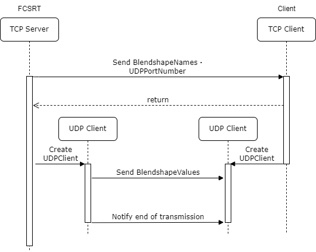

## FCSRT
FCSRTは、リアルタイム用のソフトウェアです。
UnityやUnrealEngineなどゲームエンジンと接続すると、コントローラの値をリアルタイムで送信することができます。 

**UI説明**   
1. FCSRT.exeを実行して起動します。 
  
Rndererタブ 
　Host: 接続先のIPアドレス 
　SendPort: TCP接続用のポート番号 
  UDPPort: UDP接続用のポート番号 
　Status: 接続状態を表示します。 
　LastUpdate: 最後に送信されたデータの時間を表示します。  
Srcタブ 
  Source: ソースの種類を選択(LiveCamera, VideoFile) 
  LiveCamera 
    Camera Device: カメラデバイスを選択 
  VideoFile 
    File Name: 動画ファイルのフルパス 
  Rotate: 表示するカメラ画面の回転 
  Preview: プレビュー表示 
  Open: カメラ・動画映像を表示します。値の取得も同時に開始します。 
PostProcessingタブ 
  Detect:  
  Solver:  
  Load:   
Visタブ: コントローラの一覧 

**操作説明** 
コントローラ値送信までの手順 
1. FCSRTを起動します。 
2. SendPortを指定します。このポート番号は接続先で設定したポート番号と同じにする必要があります。 
　 接続先のポート設定を確認後、Setupbroadcastingをクリックします。 
3. 接続先との通信が確立された場合、Status,LastUpdateがConnectedに変わります。 
  
4. Camera Deviceから使用するカメラを選択、または VideoFileに動画ファイルパスを指定して、Openをクリックします。 
5. RendererタブのStartをクリックし、コントローラ値の送信を開始します。 

接続後の操作 
StartボタンとStopボタンはトグルになっており、Stopボタンを押すことで送信を一時停止することができます。 
Start broadcastingを実行後、Resetボタンが表示されます。このボタンをクリックすると、コントローラ値の送信を停止し、接続先との通信を切断します。 

送信するコントローラの変更について 
postprocessingタブのLoadからSolverをダウンロードすることができます。正常にロードされた場合、Visタブにロードしたコントローラが表示されます。 

**詳細説明**
通信プロトコルについて 
　FCSRTの通信プロトコルは、TCPとUDPを用いています。 
　TCPは、コントローラ値とUDP用のポート番号をクライアントに確実に送信するために使用します。UDPは、コントローラ値をリアルタイムで送信するために使用します。 
　このため、通信の流れは以下のようになります。 
  
　UDPのポート番号は、クライアントがTCPで接続するたびに変更されます。 
  UDPの終了通知として、コントローラ値が-1の配列が送信されます。 
　クライアントの実装は、TCPで接続してコントローラ値とUDPポート番号を取得する処理と取得したUDPポートを使ってコントローラ値を受信する処理の実装が必要となります。 
  
